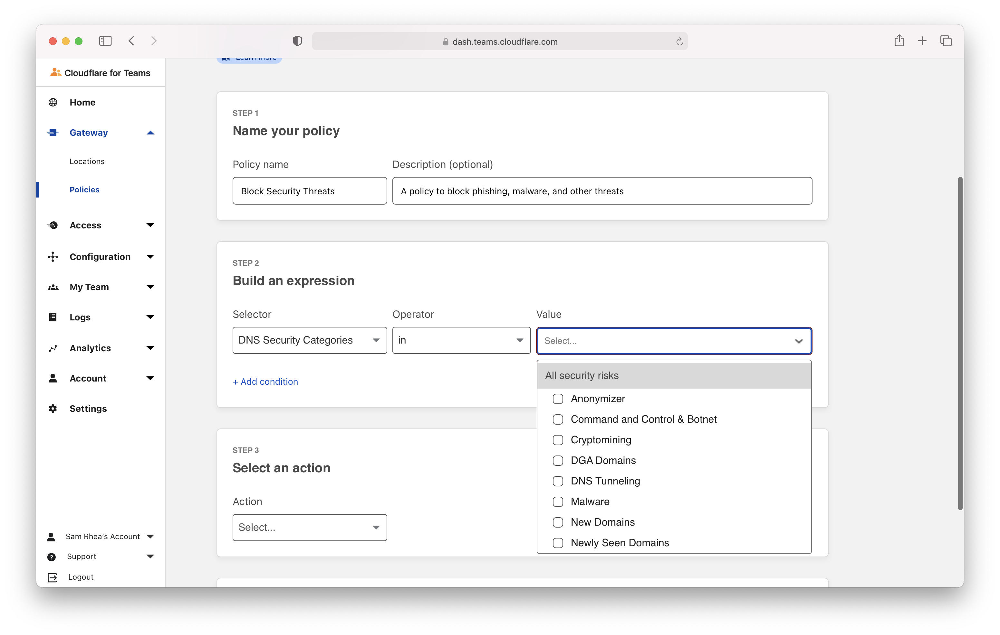
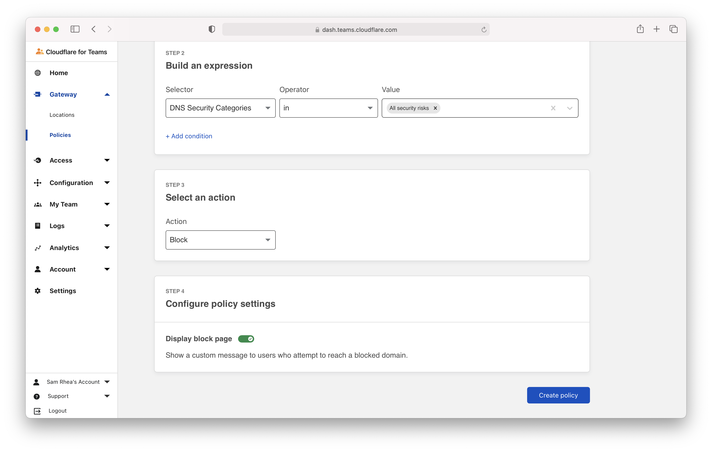
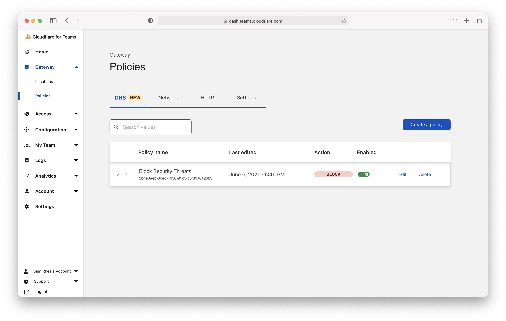
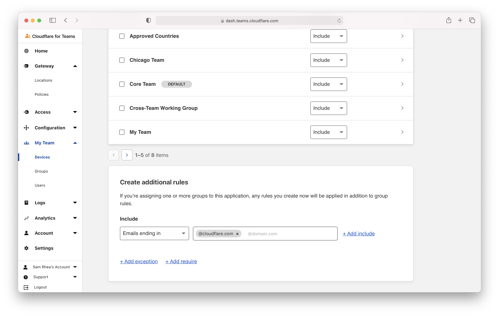
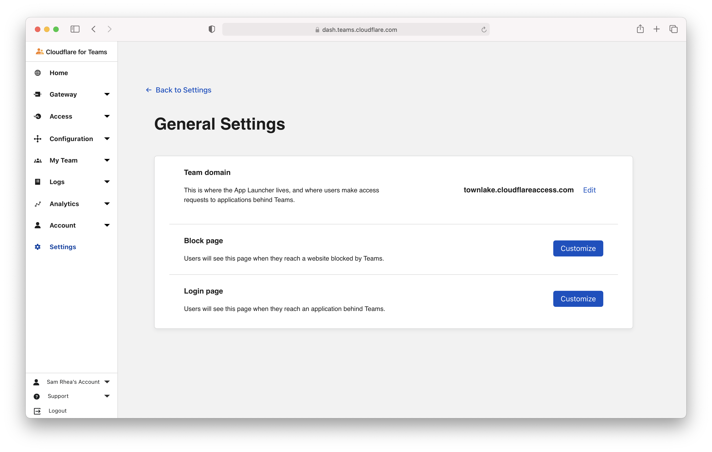
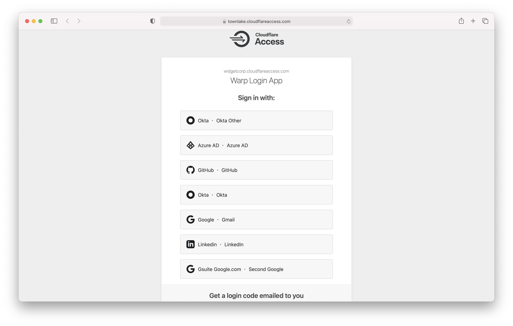
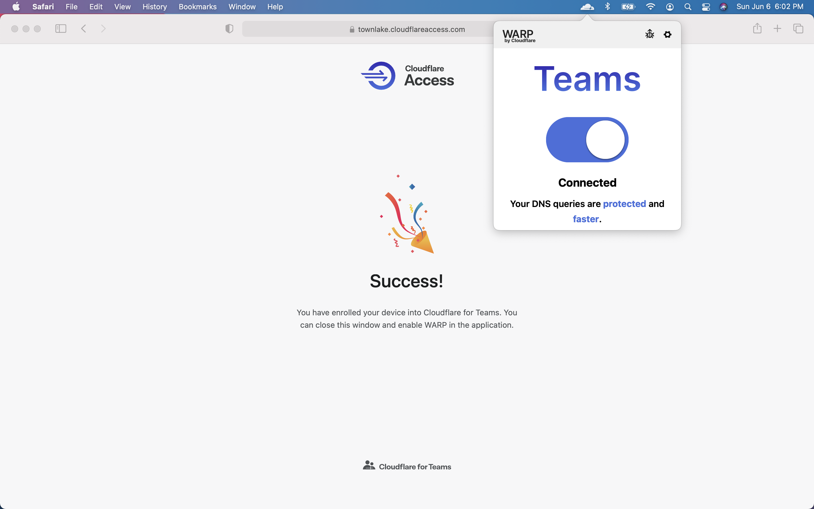

# Filter DNS on devices

You can use Cloudflare Gateway and the Cloudflare WARP client application to filter and log DNS queries from devices on any network. Cloudflare Gateway will continue to secure devices in any location by filtering all DNS queries using the WARP client on the roaming devices.

**🗺️ This tutorial covers how to:**

* Create a DNS filtering policy that secures devices by blocking malicious hostnames
* Apply that policy to devices on any network
* Enroll devices into a Cloudflare Gateway deployment

**⏲️ Time to complete:**

30 minutes

## Before you start
1. [Add Gateway to your account](/setup)

---

## Create a DNS filtering policy

You can [build a policy](/policies/filtering/dns-policies) that will filter DNS queries for known malicious hostnames and other types of threats. Navigate to the `Policies` page. On the DNS tab, click `Create a DNS policy`.

First, assign the policy a name and add an optional description. Next, build an expression to determine what is blocked.

In this example, the policy will block any hostnames that Cloudflare's data intelligence platform identifies as containing security risks like malware or phishing campaigns. You can click `All security risks` to include all options or check individual types of threats in the dropdown.

The policy will block security threats for any location or device in your Cloudflare for Teams deployment. You can specify that this should only apply to specific locations or to specific users and [directory groups](/tutorials/identity-dns).

Choose `Block` as the action. You can optionally [enable a block page](/policies/filtering/configuring-block-page) that will be presented to users if they have the [Cloudflare certificate](/connections/connect-devices/warp/install-cloudflare-cert) on their devices. Click **Save policy** to conclude.

The policy will now appear in your DNS policies list.

## Integrate your identity provider

The DNS filtering policy created will apply to any DNS queries sent from configured locations or enrolled devices. You can begin to [enroll devices](/connections/connect-devices/warp/deployment) by determining which users are allowed to enroll.

Navigate to the `Settings` section of the Cloudflare for Teams dashboard and select `Authentication`. Cloudflare for Teams will automatically create a "One-time PIN" option which will rely on your user's emails. You can begin using the one-time PIN option immediately or you can integrate your corporate [identity provider](/identity/idp-integration) as well.

## Determine which devices can enroll

Next, build a rule to decide which devices can enroll in your account. Navigate to the `Devices` page in the `My Teams` section of the sidebar.

Click **Manage enrollment rules** and click **Add a rule** to begin the enrollment.

You can determine who is allowed to enroll using criteria including Access groups, groups from your identity provider, email domain, or named users. This example allows any user with a `@cloudflare.com` account to enroll.

Return to the top of the page and click **Add rule**.

On the next page, click **Save rules** to conclude.

## Collect your Team domain

When you first created your Cloudflare for Teams account, the dashboard prompted you to choose a [team name](/glossary#team-name). The name will be in the format `team.cloudflareaccess.com` where `team` is replaced with the name you selected.

You will need this name to enroll devices. You can confirm the team name selected by visiting the `Settings` section of the dashboard and selecting `General`.

## Enroll a device

Your team members can run the WARP client to enroll in your Gateway account and send DNS queries to your configured policies. This section documents a self-serve user flow; you can alternatively [deploy the agent with an MDM](/connections/connect-devices/warp/deployment) so that users do not need to take any action.

To begin the self-serve flow, follow the [instructions here](/connections/connect-devices/warp) to install the client depending on your device type.

Once installed, click the logo in the toolbar and select the gear icon in the top right of the panel.

Under the `Account` tab, click `Login with Cloudflare for Teams`.

Input the Cloudflare for Teams [team name](/glossary#team-name).

The user will be prompted to login with the identity provider configured or with the one-time PIN flow.

Once authenticated, the client will update to `Teams` mode.

You can click the gear to toggle between `Gateway with DoH`, which only filters DNS, or `Gateway with WARP`, which functions as a full forward proxy and can filter HTTP requests. In this use case, you only need DNS filtering.

## Review logs and devices

As users enroll, you can review the users and associated devices by visiting the `My Team` section of the dashboard. You can also [review logs](/tutorials/review-gateway-block) in the `Logs` section by selecting `Gateway`. To add identity into the logs, your users will need to switch to `Gateway with WARP` mode.
