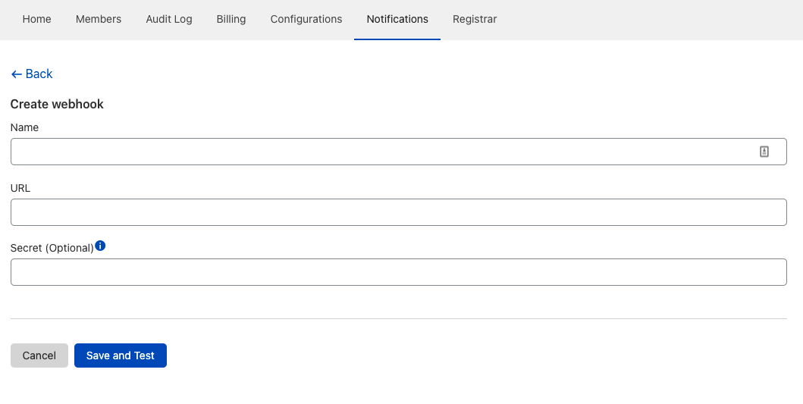

# Edit a Notification

1. Sign in to your [Cloudflare dashboard](https://dash.cloudflare.com/login).
1. Click **Notifications** on the upper right corner.
1. Click **Edit** on the Notification you want to modify.
1. Make changes as needed and click **Save**.

This will take you back to your list of Notifications.

<Aside>

You can also disable and/or delete Notifications. To disable a notification, click the **Enabled** toggle. To delete it, click **Delete**.

</Aside>

## Webhooks to external services

There are a variety of services you can connect to Cloudflare using webhooks, in order to receive Notifications from your Cloudflare account. Here are some of the most popular services you can connect to your Cloudflare account to:

* [Jira](https://developer.atlassian.com/server/jira/platform/webhooks/) 
* [Slack](https://api.slack.com/messaging/webhooks)
* [GChat](https://developers.google.com/chat/how-tos/webhooks)
* [DataDog](https://docs.datadoghq.com/developers/guide/calling-on-datadog-s-api-with-the-webhooks-integration/)
* [OpsGenie](https://docs.opsgenie.com/docs/integration-api)

After configuring the external service you want to connect to, you can set up webhooks in your [Cloudflare dashboard](https://dash.cloudflare.com/login):

1. Sign in to your [Cloudflare dashboard](https://dash.cloudflare.com/login).
1. Go to **Notifications**. 
1. Click **Destinations** on the left side of your dashboard.
1. You will see a card called **Webhooks**. Click **Create**.
1. Give your webhook a name so you can identify it later.
1. Enter the URL you set up above, in the field corresponding to the third-party service you want to connect to your Cloudflare account.
1. If needed, insert the **Secret**. Secrets are how webhooks are encrypted and vary according to the service you are connecting to Cloudflare.

  

1. Click **Save and Test** to finish setting up your webhook.
